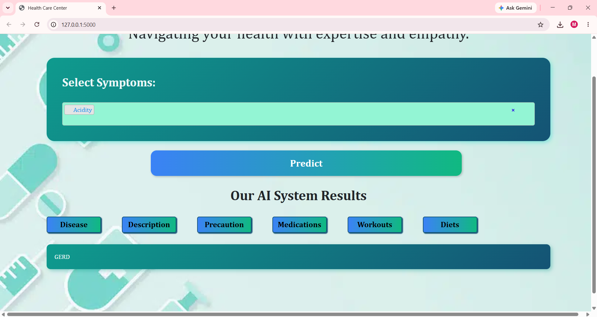
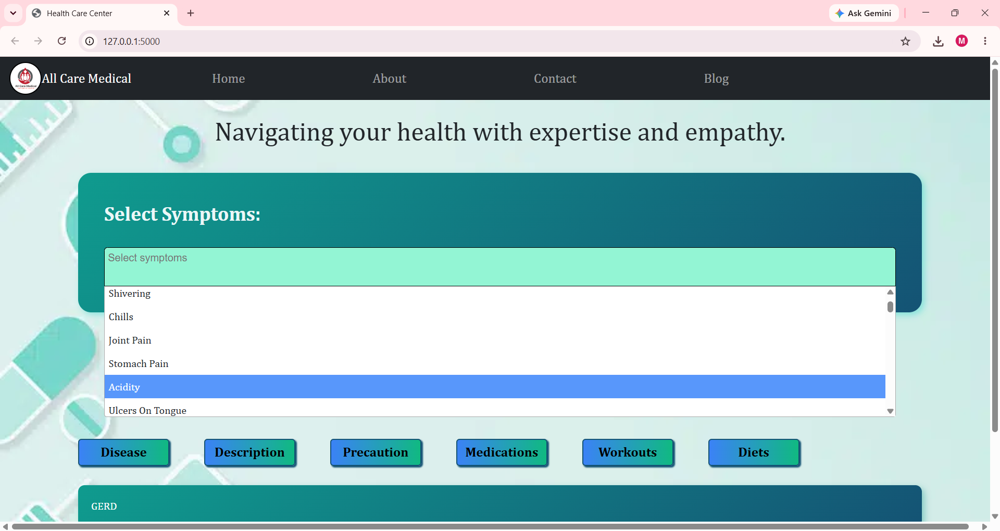
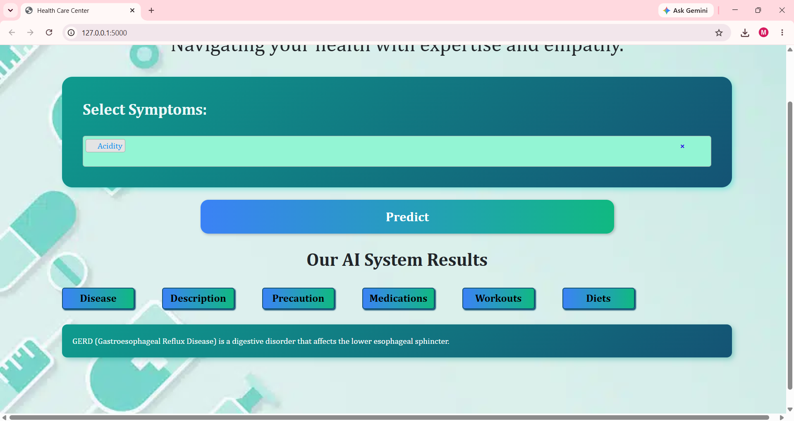
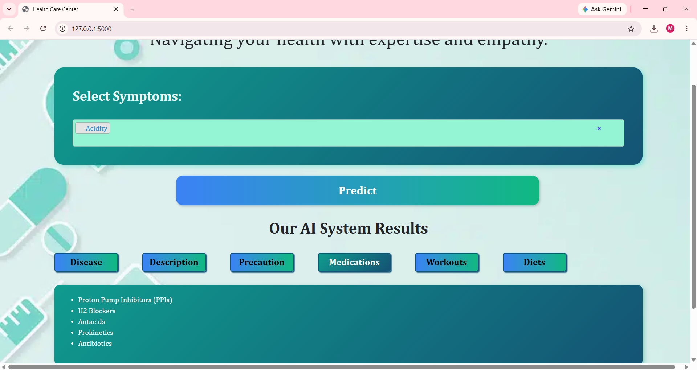
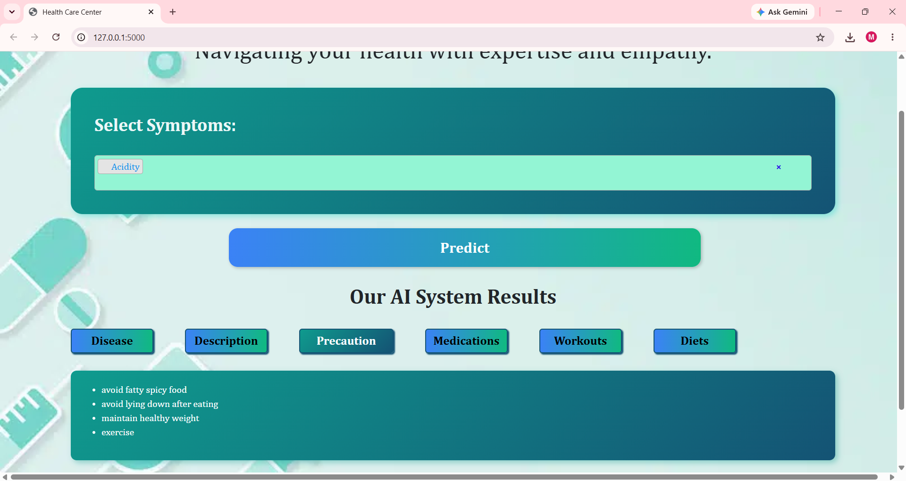
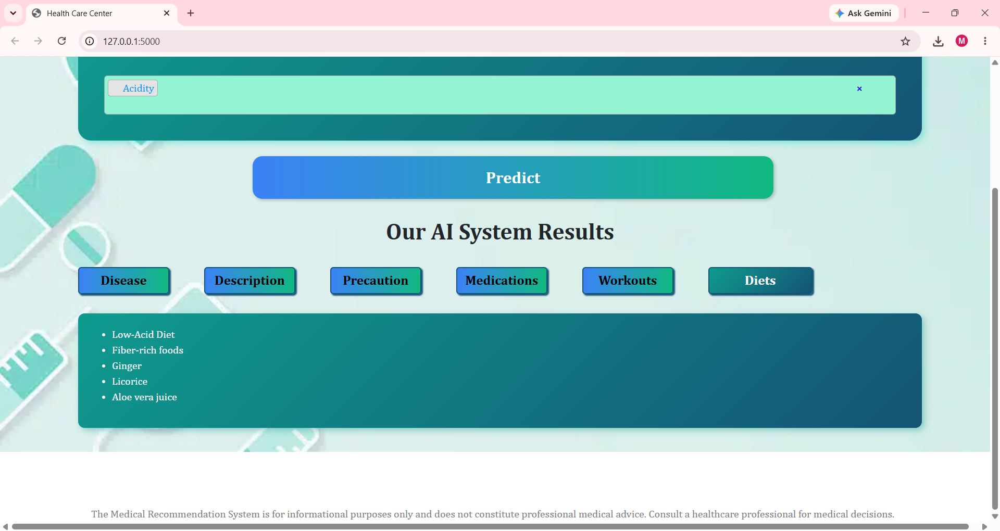
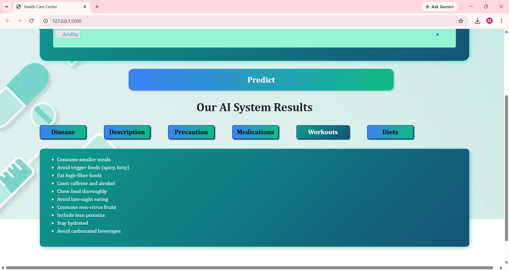

# Medicine Recommendation System

A Machine Learning-powered healthcare application that predicts diseases based on user symptoms and provides personalized recommendations, including medicines, precautions, diet plans, and workout suggestions.

---

## Overview

The Medicine Recommendation System is an intelligent healthcare assistant developed using Machine Learning and Flask. The system analyzes symptoms entered by the user, predicts the most probable disease, and generates healthcare recommendations to support recovery and well-being.

This project demonstrates the practical application of Machine Learning in healthcare by combining disease prediction with actionable medical guidance through an interactive web interface.

---

## Features

* Disease prediction based on symptoms
* Machine Learning-powered diagnosis
* Medicine recommendations
* Precaution suggestions
* Diet recommendations
* Workout and lifestyle recommendations
* User-friendly web interface
* Fast and accurate predictions

---

## Tech Stack

### Programming Language

* Python

### Machine Learning

* Scikit-learn
* Gradient Boosting Classifier

### Data Processing

* Pandas
* NumPy

### Web Framework

* Flask

### Frontend

* HTML
* CSS
* Bootstrap

### Visualization

* Matplotlib
* Seaborn

---

## Machine Learning Model

The system uses a **Gradient Boosting Classifier** trained on disease-symptom datasets to predict diseases based on user symptoms.

### Model Workflow

1. User selects symptoms.
2. Symptoms are processed and encoded.
3. The trained Gradient Boosting model predicts the disease.
4. The system retrieves:

   * Disease description
   * Recommended medicines
   * Precautions
   * Diet recommendations
   * Workout suggestions

---

## Dataset Files

The project utilizes multiple healthcare datasets:

* Training.csv
* Symptom-severity.csv
* description.csv
* medications.csv
* precautions_df.csv
* diets.csv
* workout_df.csv
* symtoms_df.csv

---

## Project Structure

```text
Medicine-Recommendation-System/
│
├── static/
├── templates/
├── main.py
├── gba.pkl
├── Training.csv
├── Symptom-severity.csv
├── description.csv
├── medications.csv
├── precautions_df.csv
├── diets.csv
├── workout_df.csv
├── symtoms_df.csv
├── Requirement.txt
└── README.md
```

---

## Installation

### Clone the Repository

```bash
git clone https://github.com/Madhuragangurde/Medicine-Recommendation-System.git
```

### Navigate to Project Directory

```bash
cd Medicine-Recommendation-System
```

### Install Dependencies

```bash
pip install -r Requirement.txt
```

### Run the Application

```bash
python main.py
```

### Open in Browser

```text
http://127.0.0.1:5000
```

---

## Application Screenshots

### Home Page

The landing page where users can begin the disease prediction process.



---

### Symptom Selection

Users can select symptoms to predict diseases accurately.



---

### Disease Prediction

The machine learning model predicts the most probable disease based on selected symptoms.



---

### Medicine Recommendation

The application recommends medicines related to the predicted disease.



---

### Precautions

Important precautionary measures suggested to improve recovery.



---

### Diet Recommendations

Personalized diet recommendations to support overall health.



---

### Workout Recommendations

Workout and lifestyle recommendations for maintaining good health and improving recovery.



---

## Future Enhancements

* Integration with real-time healthcare APIs
* Advanced disease prediction using Deep Learning
* Doctor appointment scheduling
* Personalized health tracking
* Multi-language support
* Mobile application development

---

## Author

**Madhura Sanjay Gangurde**

Aspiring Data Analyst | Machine Learning Enthusiast | Python Developer

GitHub: https://github.com/Madhuragangurde

---

## License

This project is licensed under the MIT License.
